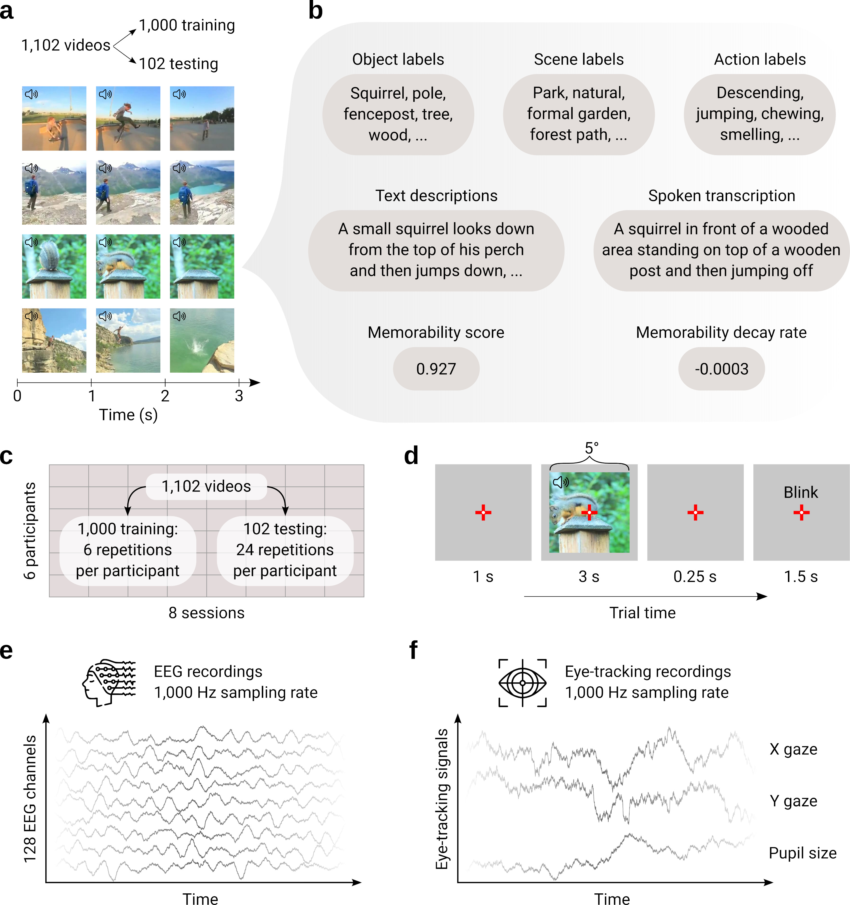

# !!!!!!!!!!!!!!!!!!!!!! PAPER TITLE !!!!!!!!!!!!!!!!!!!!!!!

Here we provide the code to reproduce all results from the paper:</br>
"[!!!!!!!!!!!!!!!!!!!!!! PAPER TITLE !!!!!!!!!!!!!!!!!!!!!!!](!!!!!!!!!!!!!!!!!!!!!!!!!!!!!!!!!1)".</br>
Alessandro T. Gifford, Pablo Oyarzo, Anne W. Zonneveld, Christina Sartzetaki, Iris I.A. Groen, Radoslaw M. Cichy




## 📜 Paper abstract

!!!!!!!!!!!!!!!!!!!!!!!!!!!!!!!!!!!!


## ♻️ Reproducibility

### 🧰 Data

The EEG Moments Dataset (EMD) is freely available at [!!!!!!!!!!!!!!!!!!!!!!!!!!!!!!!!](!!!!!!!!!!!!!!!!!!!!!!!!!!!!!!!!).


### ⚙️ Installation

This repository contains code to reproduce all paper's results.

To run the code, you first need to install the libraries in the [requirements.txt](https://github.com/gifale95/EMD/blob/main/requirements.txt) file within an Anaconda environment. Here, we guide you through the installation steps.

First, create an [Anaconda](https://docs.conda.io/projects/conda/en/latest/user-guide/tasks/manage-environments.html) environment with the correct Python version:

```shell
conda create -n emd_env python=3.9
```

Next, download the [requirements.txt](https://github.com/gifale95/EMD/blob/main/requirements.txt) file, navigate with your terminal to the download directory, and activate the Anaconda environment previously created with:

```shell
source activate emd_env
```

Now you can install the libraries with:

```shell
pip install -r requirements.txt
```


### 📦 Code description !!!!!!!!!!!!!!!!!!!!!!!!!!!!!!!!!!!!!!!!!

* **[`00_prepare_fmri`](https://github.com/gifale95/NSD-synthetic/blob/main/00_prepare_fmri):** Prepare NSD-synthetic and NSD-core's fMRI responses for the following analyses.
* **[`paper_figure_2`](https://github.com/gifale95/NSD-synthetic/blob/main/paper_figure_2):** Analyse NSD-synthetic's univariate and multivariate fMRI responses, and noise ceiling signal-to-noise ratio (ncsnr).
* **[`paper_figure_3`](https://github.com/gifale95/NSD-synthetic/blob/main/paper_figure_3):** Perform multidimensional scaling (MDS) on NSD-synthetic and NSD-core's fMRI responses.
* **[`paper_figure_4`](https://github.com/gifale95/NSD-synthetic/blob/main/paper_figure_4):** Train encoding model on NSD-core, and test them both in-distribution (NSD-core) and out-of-distribution (NSD-synthetic).
* **[`paper_figure_5`](https://github.com/gifale95/NSD-synthetic/blob/main/paper_figure_5):** Compare diffent encoding models based on their in-distribution (NSD-core) and out-of-distribution (NSD-synthetic) performances.
* **[`paper_figure_6`](https://github.com/gifale95/NSD-synthetic/blob/main/paper_figure_6):** Compare the out-of-distribution generalization performance of encoding models tested on individual NSD-synthetic image classes.
* **[`paper_figure_7`](https://github.com/gifale95/NSD-synthetic/blob/main/paper_figure_7):** Compare the generalization performance of encoding models tested both in- and out-of-distribution on NSD-core, and out-of-distribution on NSD-synthetic.


## 🚀 Preprocessed data tutorial

Through [this interactive Colab tutorial](https://colab.research.google.com/drive/1Z5MDo8yy3sucggLQ4SMETtud2E1igRE9?usp=drive_link) in Python you will learn how to load, understand, use, and visualize EMD's preprocessed EEG and eye-tracking data.


## ❗ Issues

If you experience problems with the dataset or code please submit an issue, or get in touch with Ale Gifford (alessandro.gifford@gmail.com).


## 📜 Citation

If you use any of our data or code, please cite:

> * Gifford AT, Oyarzo P, Zonneveld AW, Sartzetaki C, Groen IIA, Cichy RM. 2026. !!!!!!!!!!!!!!!!!!!!!!!!!!!!!!!!!!!!. _arXiv_, DOI: [!!!!!!!!!!!!!!!!!!!!!!!!!!!!!!!!!!!1](!!!!!!!!!!!!!!!!!!!!!!!!!!!!!!!!!!!)
> * Lahner B, Dwivedi K, Iamshchinina P, Graumann M, Lascelles A, Roig G, Gifford AT, Pan B, Jin S, Murty AR, Kay K, Oliva A, Cichy RM. 2024. Modeling short visual events through the BOLD moments video fMRI dataset and metadata. _Nature Communications_, 15(1), 6241. DOI: [https://doi.org/10.1038/s41467-024-50310-3](https://doi.org/10.1038/s41467-024-50310-3)